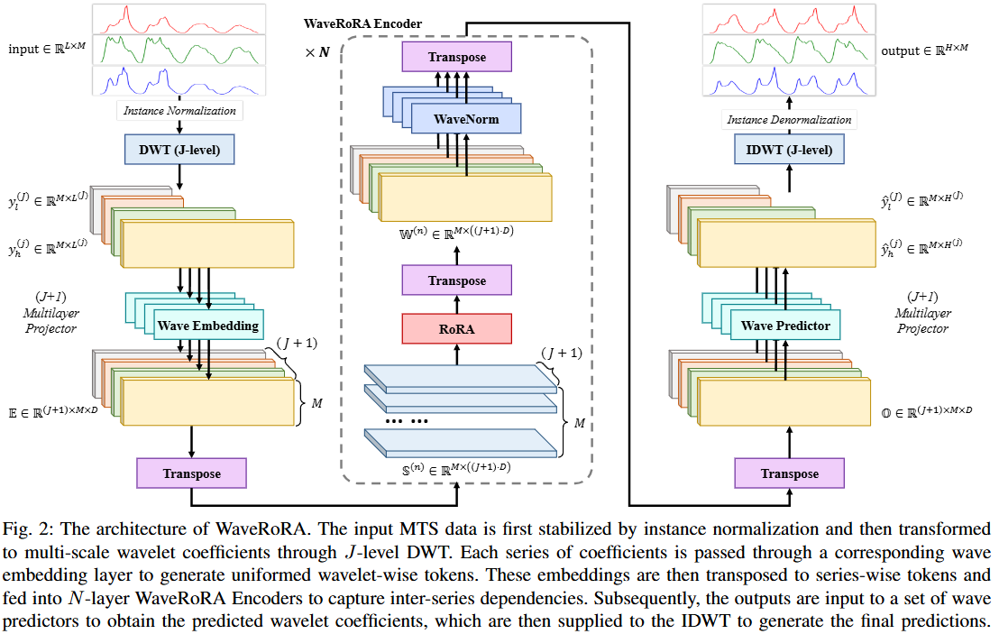
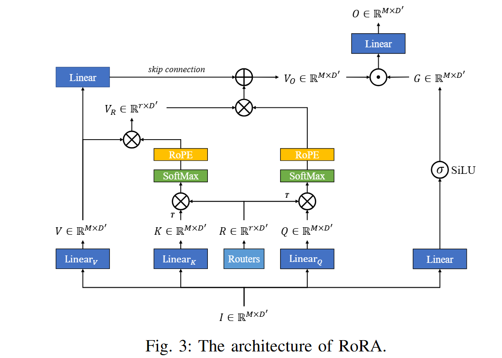
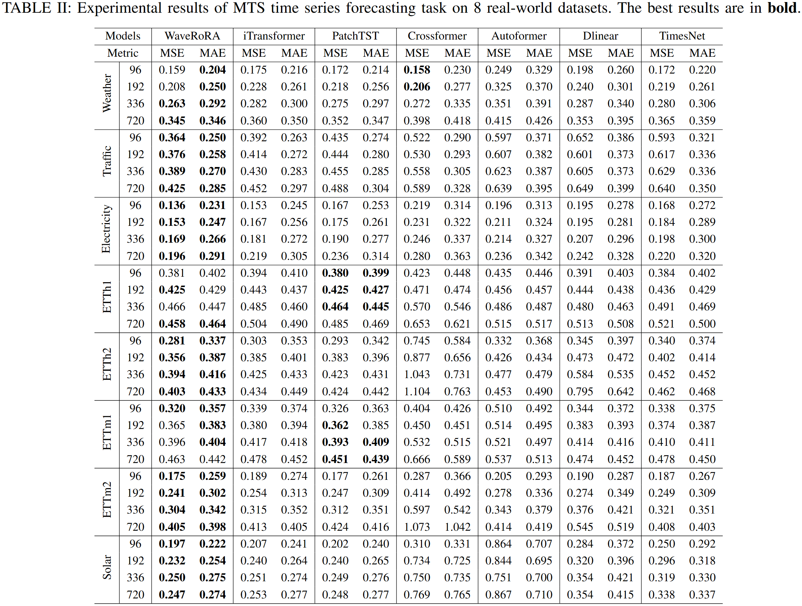
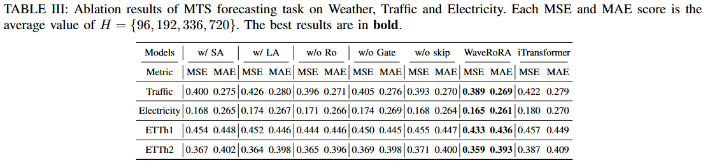

# WaveRoRa: Wavelet Rotary Router Attention for Multivariate Time Series Forecasting

### This is the official implementation of **[WaveRoRa: Wavelet Rotary Router Attention for Multivariate Time Series Forecasting](https://arxiv.org/abs/2410.22649)**.

  -da282a?style=plastic)        

🚩**News**(Nov 21, 2024): We set the repo public for friendly discussion.

🚩**News**(Oct 17, 2024): We upload the code to Github. The repo is currently private.

# Key Designs of the proposed WaveRoRA🔑
🤠 We propose a deep architecture to process time series data in the **wavelet domain**. We decompose time series into multi-scale wavelet coefficients through Discrete Wavelet Transform (DWT) and use deep models to capture intra- and inter-series dependencies.

🤠 We propose a novel Rotary Router Attention (RoRA) mechanism. Compared to vanilla Softmax Attention, RoRA utilizes rotary positional embeddings (RoPE) to model the relative position information between different sequence elements. In addition, RoRA introduces a fixed number of router tokens $R\in\mathbb{R}^{r\times d}$ to aggregate information from $KV$ matrices and reassign it to $Q$ matrix. Note that $Q,K,V\in\mathbb{R}^{N\times d}$ where $N$ represents the sequence number and $d$ refers to the token dimension. We set $r\ll N$ so that RoRA achieves a good balance between computational efficiency and the ability to capture global dependencies.

🤠 We conduct extensive experiments and find that transfering other deep model architectures to wavelet domain also leads to better predicting results.

# Model Architecture

<div style="text-align: center;"></div>

# Results✅

## Main Results

WaveRoRA gets superior predicting performance. Compared to iTransformer, WaveRoRA reduces the MSE by 5.91% and MAE by 3.50% on average.



## Ablation Studies
We conduct experiments of (a) w/ SA which replaces RoRA with Softmax Attention, (b) w/ LA which replaces RoRA with Linear Attention, (c) w/o Ro which removes RoPE, (d) w/o Gate which removes the gating module and (e) w/o skip which removes the skip connection module on datasets of Traffic, Electricity, ETTh1 and ETTh2. The modules of WaveRoRA are proved effective.




# Getting Start🛫
Create the following paths before you want to run one of the model: `./logs/LTSF/${model_name}/`. Then, run `./scripts/LTSF/${model_name}/${dataset}.sh`.

# Datasets🔗
We have compiled the datasets we need to use and provide download link: [data.zip](https://drive.google.com/file/d/1krbMHQXB-aV9vvYs2bRsJnXPLa4BKxzG/view?usp=drive_link).

# Acknowledgements🙏
We are really thankful for the authors of [**pytorch_wavelets**](https://github.com/fbcotter/pytorch_wavelets) and the following awesome works when implementing WaveRoRA.

[**iTransformer**](https://github.com/thuml/iTransformer)

[**RoFormer**](https://github.com/ZhuiyiTechnology/roformer)

# Citation🙂
```
@article{liang2024waverora,
  title={WaveRoRA: Wavelet Rotary Route Attention for Multivariate Time Series Forecasting},
  author={Liang, Aobo and Sun, Yan},
  journal={arXiv preprint arXiv:2410.22649},
  year={2024}
}
```
