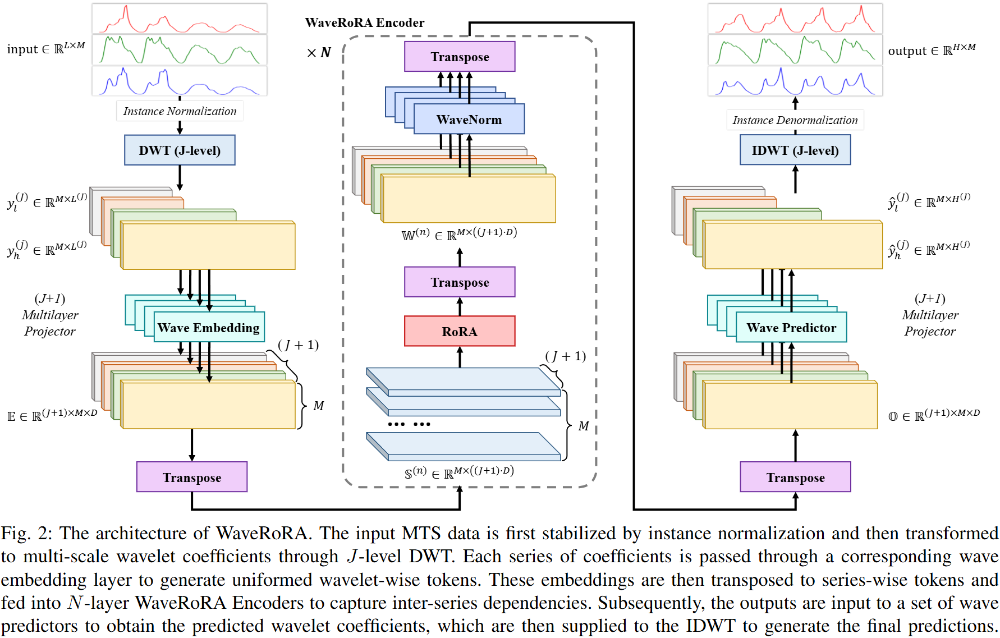
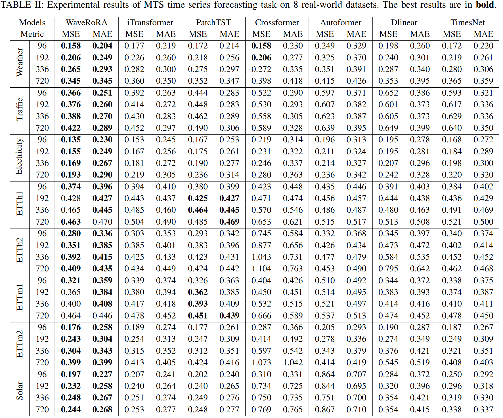

# WaveRoRA: Wavelet Rotary Route Attention for Multivariate Time Series Forecasting

### This is the official implementation of **[WaveRoRA: Wavelet Rotary Route Attention for Multivariate Time Series Forecasting](https://arxiv.org/abs/2410.22649)**

  -da282a?style=plastic)        

🚩**News**(June 3, 2025): We update new scripts and experimental settings and optimize the framework of snippets.

🚩**News**(Nov 21, 2024): We set the repo public for friendly discussion.

🚩**News**(Oct 17, 2024): We upload the code to Github. The repo is currently private.

# Key Designs of the proposed WaveRoRA🔑
🤠 We propose a deep architecture to process time series data in the **wavelet domain**. We decompose time series into multi-scale wavelet coefficients through Discrete Wavelet Transform (DWT) and propose a series-wise wavelet tokenization method.

🤠 We propose a novel Rotary Route Attention (RoRA) mechanism. RoRA introduces a fixed number of router tokens $R\in\mathbb{R}^{r\times d}$ to aggregate information from $KV$ matrices and reassign it to $Q$ matrix. Note that $Q,K,V\in\mathbb{R}^{N\times d}$ where $N$ represents the sequence number and $d$ refers to the token dimension. We set $r\ll N$ so that RoRA achieves a good balance between computational efficiency and the ability to capture global dependencies. Note that RoRA can be simplified to the form of linear attention, therefore, we use rotary positional embeddings (RoPE) to enhance the model's feature diversity.

🤠 We conduct extensive experiments and find that transfering other deep model architectures to wavelet domain also leads to better predicting results.

# Model Architecture

<div style="text-align: center;"></div>

# Results✅

## Main Results

WaveRoRA gets superior predicting performance. Compared to iTransformer, WaveRoRA reduces the MSE by 5.97% and MAE by 3.38% on average.



## Ablation Studies
### Wavelet Learning Framework
We change the tokenization embedding layer to pure time domain and frequency domain embeddings and use RoRA to capture inter-series dependencies. The tokenization method for different domains can be written as follows:
$$
\mathbb{E}_i^T=\mathrm{TimeEmbedding}(x_i)=x_iW^\top+b^\top\\
\mathbb{E}_i^F=\mathrm{FreqEmbedding}(x_i)=\left|\mathrm{rFFT}(x_i)\right|W^\top+b^\top
$$
where $\mathrm{rFFT}$ represents Real Fast fourier transform. The results indicate that our wavelet learning framework achieves good balance in extracting information from time and frequency domains.
<div style="text-align: center;">
    
</div>

### RoRA structure
We conduct experiments of (a) w/ SA which replaces RoRA with Softmax Attention, (b) w/ LA which replaces RoRA with Linear Attention, (c) w/ RA which removes RoPE, (d) w/ RoSA which adds RoPE to Softmax Attention and (e) w/ RoLA which adds RoPE to Linear Attention on datasets of Traffic, Electricity, ETTh1 and ETTh2. The modules of WaveRoRA are proved effective. Compared to SA and LA, our proposed Route Attention also improves MSE and MAE by 1.14% & 0.74% and 3.23% & 1.11% on average.


# Getting Start🛫
Create the following paths before you want to run one of the model: `./logs/LTSF/${model_name}/`. Then, run `./scripts/LTSF/${model_name}/${dataset}.sh 1`. The number at the end indicates the type of task initiated.
> **1**: training; **0**: testing; **-1**: predicting

We provide pretrained parameters [here](https://drive.google.com/file/d/1fITlQ1mU18eKuP-8N2xI6_x4y-FN_3ba/view?usp=drive_link). You can download them and extract the files in `./checkpoints` (you have to create the folder in the rootpath by yourself).

# Datasets🔗
We have compiled the datasets we need to use and provide download link: [data.zip](https://drive.google.com/file/d/1krbMHQXB-aV9vvYs2bRsJnXPLa4BKxzG/view?usp=drive_link).

# Acknowledgements🙏
We are really thankful for the authors of [**pytorch_wavelets**](https://github.com/fbcotter/pytorch_wavelets) and the following awesome works when implementing WaveRoRA.

[**iTransformer**](https://github.com/thuml/iTransformer)

[**RoFormer**](https://github.com/ZhuiyiTechnology/roformer)

# Citation🙂
```
@article{liang2024waverora,
  title={WaveRoRA: Wavelet Rotary Route Attention for Multivariate Time Series Forecasting},
  author={Liang, Aobo and Sun, Yan},
  journal={arXiv preprint arXiv:2410.22649},
  year={2024}
}
```
